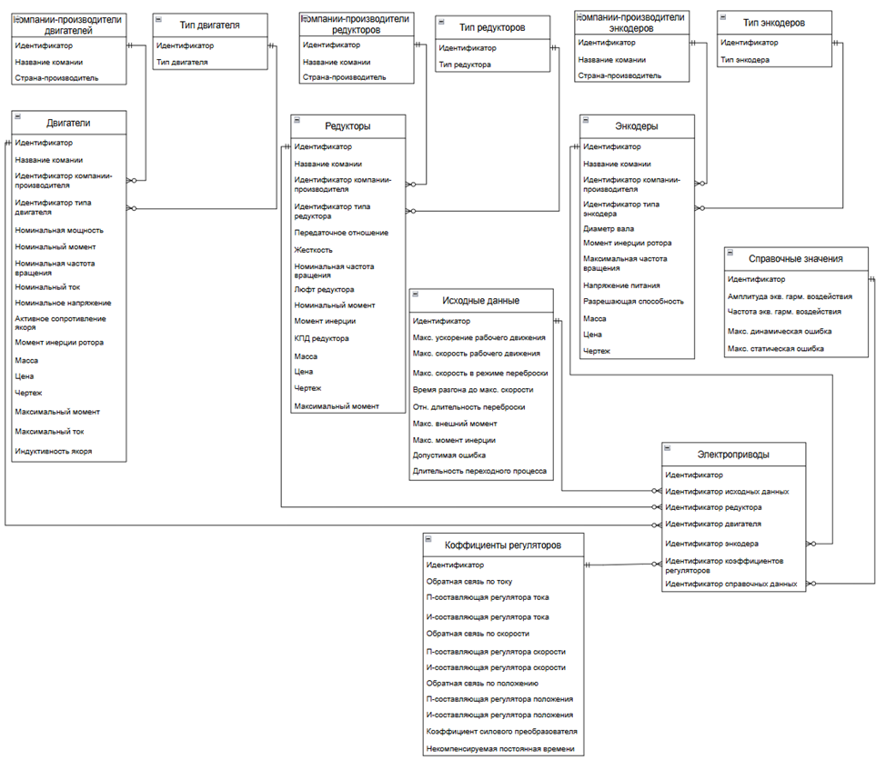
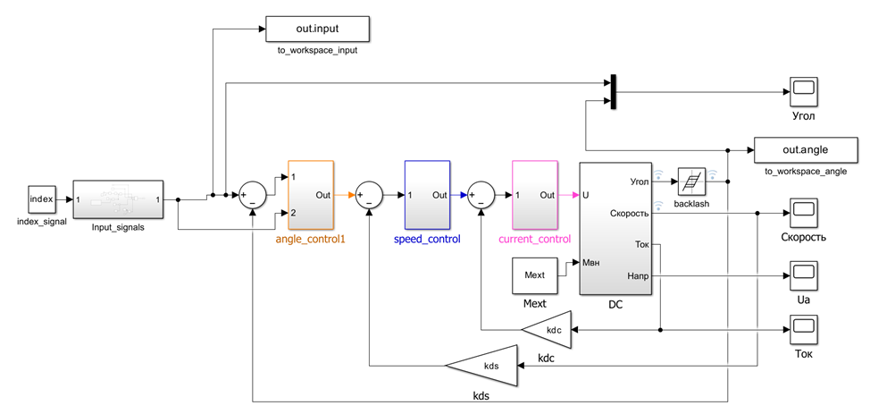
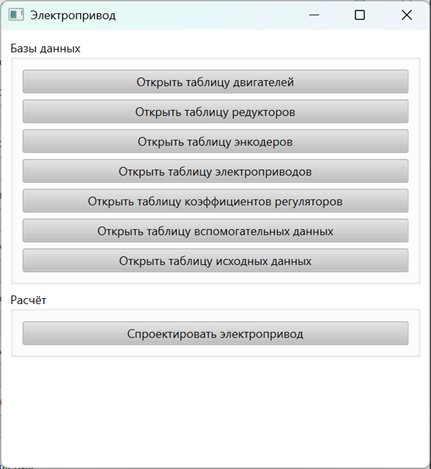
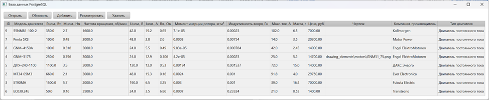
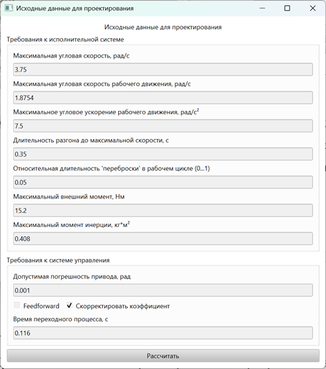
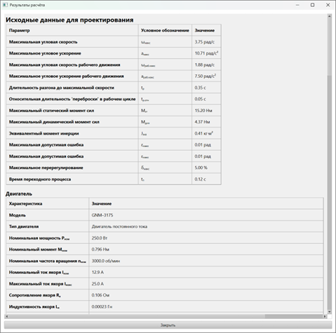
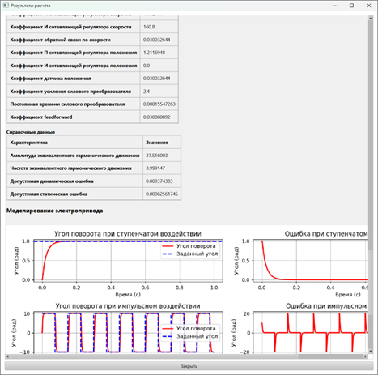

# База данных для автоматизации проектирования электропривода на базе двигателя постоянного тока независимого возбуждения

## Требования
- Python 3.13
- Windows 10/11

Также, для использованния данного ПО необходимо установить следующие программы:
- PostgreSQL и pgAdmin4
- Matlab

После проделанных шагов установите все необходимые библиотеки
```bash
pip install -r requirements.txt
```
## Восстанолвение БД

После установки postgreSQL и pgAdmin4 вы можете восстановить базу данных, которую использовал я. Для этого:

1. Создайте пустую базу `robots_database`:
    - Кликните правой кнопкой мыши на `Databases` -> `Create` -> `Database...`
    - В поле `Database` напишите `robot_database`
    - Остальное можно оставить по умолчанию -> `Save`
2. Восстановите дамп:
    - Кликните ПКМ на `robots_database` -> `Restore...`
    - В поле `Filename` выберите `backup_robots_database_full_sql.sql` (сохранил в корневой папке `robots_database`)
    - На вкладвке `Restore Options` -> `Format` выберите `Plain`
    - Нажмите `Restore`.

После проделанных шагов у вас должна появиться БД в pgadmin. Теперь необходимо добавить конфиг файл с названием `login_data.yaml` в папку `configs`. Формат файла:
```yaml
username: 'YOUR_USER_NAME'   
password: 'YOUR_PASSWORD'  
host: 'localhost'           
port: 5432               
database_name: 'robots_database'
```
В поля `username` и `password` необходимо ввести свои данные, которые вы указывали при установке PostgreSQL и pgAdmin.

## Структура БД

ERM-диаграмма базы данных показана ниже.


Она состоит из:
- таблицы двигателей;
- таблицы редукторов;
- таблицы энкодеров;
- справочных таблиц (компании-производители и тип элементов);
- таблицы исходных данных (указываются при проектировании);
- таблицы коэффициентов регуляторов (П-регулятор положения, ПИ-регулятор скорости, ПИ-регулятор тока, feedforward регулятор);
- таблицы справочных значений (амплитуда и частота эквивалентного гармонического воздействия);
- таблицы электроприводов (результирующая таблица, которая содержит ссылки).

## Математическая модель электропривода
Для моделирования электропривода использовался Matlab Simulink. Математичская модель находится по пути `MatlabTest/matlab_models/lab12_a.mdl`. При желании её можно открыть и скорректировать значения. 


## Запуск 
Для запуска GUI необходимо в `bash` терминал ввести:
```bash
python main.py
```
Откроется главное окно, из которого можно открыть таблицы или начать проектирование. Главное окно:



Для примера приведу скриншот таблицы двигателей:

При желании можно открыть подробную информацию о выбранном двигателе, добавить,удалить или редактировать запись.

Окно для ввода исходных данных представлено ниже:



Все значения описаны в `report.pdf`. При выборе `Feedforward` начнется поиск коэффициента feedforward-регулятора с помощью response optimizer (будет выполнен файл `MatlabTest/matlab_m_files/feedforward_optimize.m`).  
При выборе `Скорректировать коэффициент` начнется поиск коррекция коэффициента П-регулятора положения с помощью response optimizer (будет выполнен файл `MatlabTest/matlab_m_files/non_linear_optimize.m`). 
После расчётов появится окно со всеми формулами и выбранными элементами, а также графиками переходных процессов:



При желании, можно сохранить результаты в таблицу `Электроприводы`
